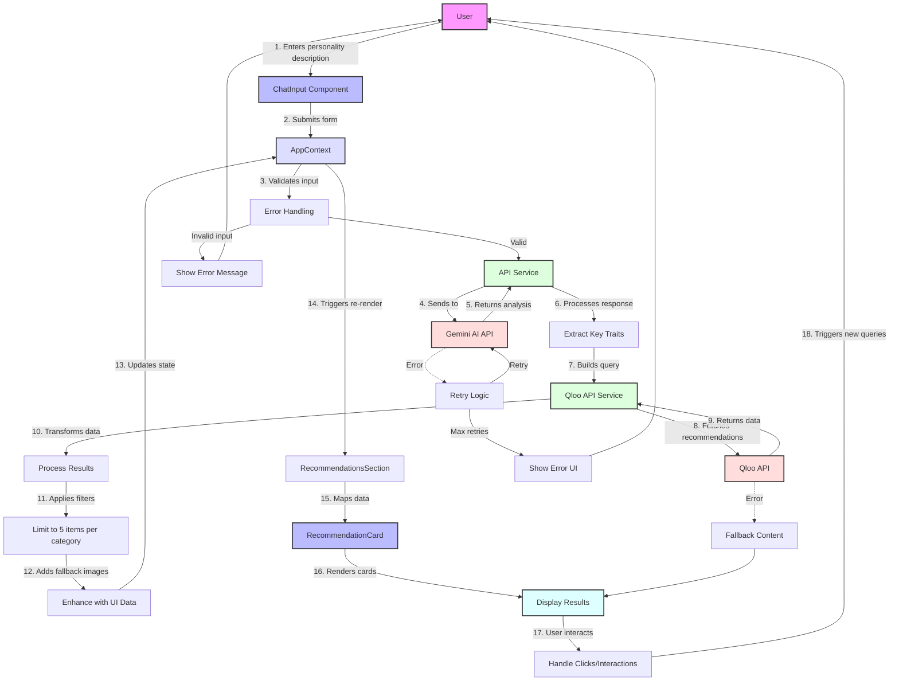

# 🎭 PopPersona - Your Pop Culture Twin Finder

Discover your pop culture twin by describing your personality! PopPersona uses AI to analyze your personality traits and match you with movies, TV shows, books, brands, and celebrities that align with your unique characteristics.

Built with React 19, Tailwind CSS 4, and powered by Gemini AI and Qloo API.

## 📊 Detailed Workflow Diagram



### Component Interactions

1. **User Input Phase**
   - User types personality description in ChatInput
   - Form submission triggers analysis
   - Input validation occurs before API calls

2. **AI Analysis Phase**
   - Gemini AI processes natural language input
   - Extracts key personality traits and interests
   - Handles rate limiting and retries

3. **API Integration Phase**
   - Constructs Qloo API queries using extracted traits
   - Manages API rate limits and errors
   - Processes and transforms API responses

4. **Data Processing Phase**
   - Limits results to 5 items per category
   - Adds fallback images and missing data
   - Structures data for UI components

5. **UI Rendering Phase**
   - Updates React state with processed data
   - Triggers re-render of recommendation components
   - Handles user interactions and feedback

6. **Error Handling**
   - Validates user input
   - Manages API failures with retry logic
   - Provides user-friendly error messages
   - Implements fallback content when needed

## ✨ Features

- **AI-Powered Analysis**: Advanced natural language processing to understand personality traits
- **Multi-Category Recommendations**: Get suggestions across movies, TV shows, books, brands, and celebrities
- **Responsive Design**: Fully responsive interface that works on all devices
- **Interactive Experience**: Chat-like interface for natural interaction
- **Smart Error Handling**: Graceful handling of API limits and errors
- **Optimized Performance**: Efficient state management and API calls
- **Modern UI/UX**: Clean, intuitive interface with smooth animations

## 🚀 Quick Start

### Prerequisites

- Node.js 18+ and npm
- Gemini API key ([Get one here](https://ai.google.dev/))
- Qloo API key (Hackathon API)

### Installation

```bash
# Clone the repository
git clone https://github.com/Darkcoder011/PopPersona.git
cd PopPersona

# Install dependencies
npm install

# Set up environment variables
cp .env.example .env
# Edit .env with your API keys

# Start development server
npm run dev
```

### Environment Variables

Create a `.env` file in the root directory with the following variables:

```env
VITE_GEMINI_API_KEY=your_gemini_api_key_here
VITE_QLOO_API_KEY=your_qloo_api_key_here
```

## 🏗️ Project Structure

```
src/
├── components/       # Reusable UI components
├── context/         # React context providers
├── services/        # API and external service integrations
├── styles/          # Global styles and Tailwind configuration
└── utils/           # Utility functions and helpers
```

## 🤖 How It Works

### Technical Implementation

1. **Frontend**:
   - React 19 with functional components and hooks
   - Tailwind CSS for styling
   - Framer Motion for animations
   - Context API for state management

2. **Backend Services**:
   - Gemini AI for natural language processing
   - Qloo API for cultural recommendations
   - Axios for HTTP requests

3. **Performance Optimizations**:
   - Lazy loading of components
   - Memoization for expensive computations
   - Efficient API call management

### API Integration

The application integrates with two main APIs:

1. **Gemini AI**: Processes user input to extract personality traits
2. **Qloo API**: Provides personalized recommendations based on the analyzed traits

## 🛠️ Built With

- [React 19](https://react.dev/) - Frontend library
- [Vite](https://vitejs.dev/) - Build tool
- [Tailwind CSS 4](https://tailwindcss.com/) - Utility-first CSS framework
- [Framer Motion](https://www.framer.com/motion/) - Animation library
- [Gemini AI](https://ai.google.dev/) - AI/ML platform
- [Qloo API](https://www.qloo.com/) - Cultural AI insights

## 📝 Usage

1. Type a description of your personality in the chat input (e.g., "I'm an adventurous person who loves sci-fi and technology")
2. Wait for the AI to analyze your input and generate recommendations
3. Browse through your personalized pop culture matches
4. Click on any recommendation to learn more

## 📱 Responsive Design

PopPersona works seamlessly on desktop, tablet, and mobile devices.

## 🚦 Available Scripts

In the project directory, you can run:

### `npm run dev`

Runs the app in development mode. Open [http://localhost:5173](http://localhost:5173) to view it in your browser. The page will reload when you make changes.

### `npm run build`

Builds the app for production to the `dist` folder. It bundles React in production mode and optimizes the build for the best performance.

### `npm run preview`

Serves the production build from the `dist` folder locally.

### `npm run lint`

Runs ESLint to check for code quality issues.

## 🤝 Contributing

Contributions are welcome! Please feel free to submit a Pull Request.

1. Fork the repository
2. Create your feature branch (`git checkout -b feature/AmazingFeature`)
3. Commit your changes (`git commit -m 'Add some AmazingFeature'`)
4. Push to the branch (`git push origin feature/AmazingFeature`)
5. Open a Pull Request

## 📄 License

This project is licensed under the MIT License - see the [LICENSE](LICENSE) file for details.

## 🙏 Acknowledgments

- Built using the [React + Tailwind CSS Starter Kit](https://github.com/labnol/react-tailwind)
- Powered by [Gemini AI](https://ai.google.dev/) and [Qloo API](https://www.qloo.com/)
- Icons from [Heroicons](https://heroicons.com/)
- Beautiful UI components with [Tailwind CSS](https://tailwindcss.com/) and [Framer Motion](https://www.framer.com/motion/)
